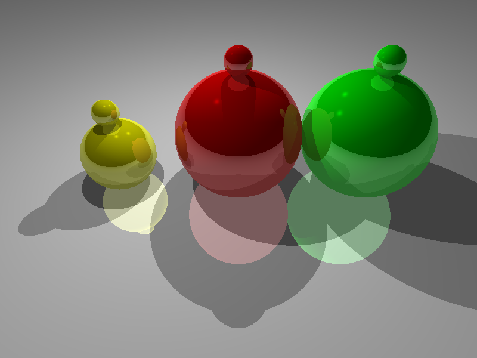

# Ray Tracing in JavaScript

## Project Overview

This project implements a ray tracer using JavaScript. The application renders 3D scenes described in external JSON files, featuring camera attributes, objects (spheres and planes), and light sources. It demonstrates various lighting components and reflection effects.


- **Access this project:** https://komar41.github.io/shadow-maps-webgl/
- **GitHub Repository:** https://github.com/komar41/shadow-maps-webgl/
- **Tools used:** WebGL, JavaScript, HTML, CSS

## How to Use
1. Visit the [live demo](https://komar41.github.io/shadow-maps-webgl/) or run the project locally.
2. Use the configuration panel to upload a JSON scene file (e.g., [scene 1](https://github.com/komar41/ray-tracing/blob/main/scene-1.json) or [scene 2](https://github.com/komar41/ray-tracing/blob/main/scene-2.json)).
3. Adjust rendering settings using the provided controls.
4. Explore the rendered scene on the canvas.

## Key Features

### Ray Tracing Engine

* Implements ray tracing algorithm for spheres and planes
* Calculates precise intersections between rays and objects
* Supports recursive ray tracing for reflections

### Advanced Lighting Model

* Utilizes Blinn-Phong shading model
* Incorporates ambient, diffuse, and specular lighting components
* Calculates shadows for realistic light interactions

After adding ambient, rendered scene should look like the following:


After adding diffuse, rendered scene should look like the following:


After adding specular, rendered scene should look like the following:


Rendered scene with reflection considering a max depth of 1 should look like following:



Rendered scene with reflection considering a max depth of 5 should look like following:


### Customizable Scene Rendering

* Parses scene information from JSON files
* Supports flexible camera settings
* Allows for multiple light sources and object types

### Interactive User Interface

* Real-time rendering on HTML canvas
* Configuration panel for adjusting lighting components and reflection depth
* File upload functionality for custom scene descriptions

## Technical Implementation

### Core Classes

1. **Ray:** Encapsulates ray properties (origin and direction)
2. **Intersection:** Stores intersection data (distance and point)
3. **Hit:** Combines intersection data with the intersected object

### Key Functions

* `render()`: Initiates ray tracing for each pixel
* `trace()`: Recursive function for tracing rays through the scene
* `intersectObjects()`: Checks for intersections with all scene objects
* `raySphereIntersection()` & `rayPlaneIntersection()`: Calculate specific object intersections
* `shade()`: Applies the Blinn-Phong model and handles reflections
* `isInShadow()`: Determines shadow casting for points

### Utility Functions

The project includes `utils.js` with vector operations such as:
* Dot product calculation
* Vector scaling, addition, and subtraction
* Vector length computation
* Ray reflection

## Scene Description Format

The application uses a JSON format for scene descriptions:

```
{
    "camera": {
        "position": [x, y, z],
        "fov": fovValue,
        "direction": [x, y, z]
    },
    "objects": [
        {
            "center": [x, y, z],
            "normal": [x, y, z],  // for planes
            "radius": value,      // for spheres
            "color": [r, g, b],
            "specularExponent": value,
            "specularK": value,
            "ambientK": value,
            "diffuseK": value,
            "reflectiveK": value,
            "type": "sphere" or "plane"
        }
    ],
    "lights": [
        {
            "position": [x, y, z]
        }
    ]
}
